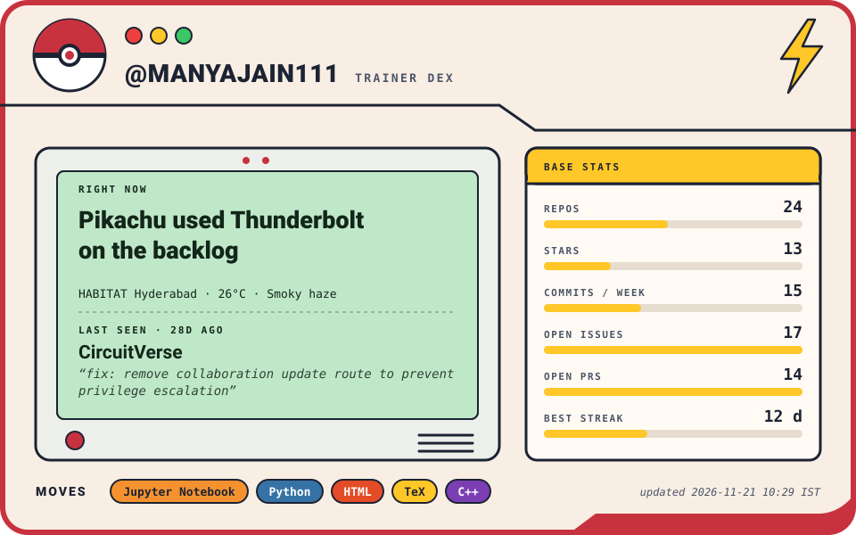

<!--
```json
{
  "status": "Pikachu used Thunderbolt on the backlog",
  "weather": {
    "location": "Hyderabad",
    "temperature": "26°C",
    "condition": "Smoky haze"
  },
  "github": {
    "top_languages": [
      "Jupyter Notebook",
      "Python",
      "HTML",
      "TeX",
      "C++"
    ],
    "latest_active_repo": "CircuitVerse",
    "last_commit": "2026-10-23T16:50:18Z",
    "last_commit_message": "fix: remove collaboration update route to prevent privilege escalation",
    "current_streak": 0,
    "longest_streak": 12,
    "commits_last_7_days": 15,
    "open_issues": 17,
    "open_prs": 14,
    "total_repos": 24,
    "total_stars": 13,
    "most_starred_repo": {
      "name": "ml-chips",
      "stars": 1
    }
  },
  "updated": "2026-11-21 10:29 IST"
}
```
-->
