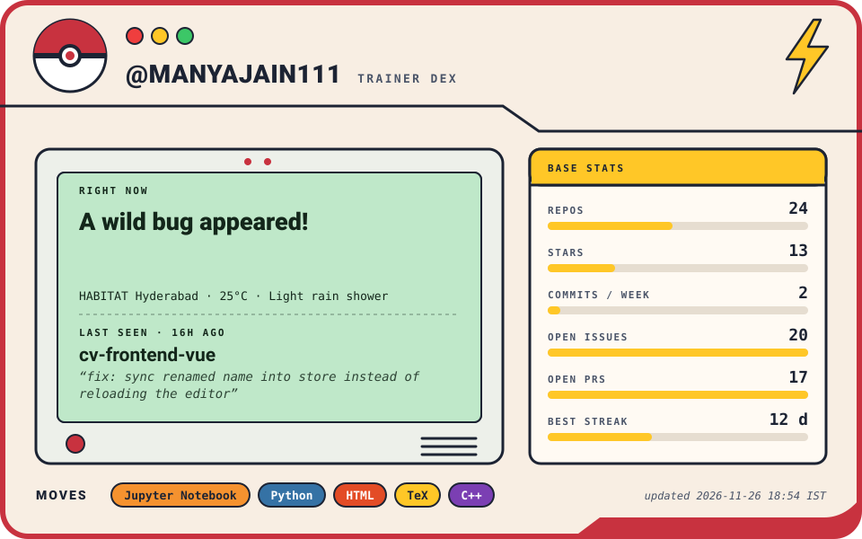

<!--
```json
{
  "status": "A wild bug appeared!",
  "weather": {
    "location": "Hyderabad",
    "temperature": "25°C",
    "condition": "Light rain shower"
  },
  "github": {
    "top_languages": [
      "Jupyter Notebook",
      "Python",
      "HTML",
      "TeX",
      "C++"
    ],
    "latest_active_repo": "cv-frontend-vue",
    "last_commit": "2026-11-25T21:19:01Z",
    "last_commit_message": "fix: sync renamed name into store instead of reloading the editor",
    "current_streak": 3,
    "longest_streak": 12,
    "commits_last_7_days": 2,
    "open_issues": 20,
    "open_prs": 17,
    "total_repos": 24,
    "total_stars": 13,
    "most_starred_repo": {
      "name": "ml-chips",
      "stars": 1
    }
  },
  "updated": "2026-11-26 18:54 IST"
}
```
-->
